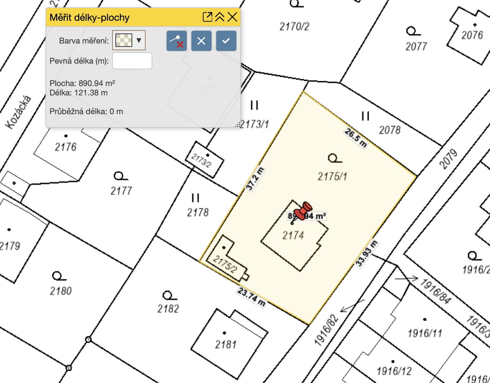

# Popis stávajícího stavu – Dům Liberec

## Základní identifikace

| | |
|---|---|
| **Adresa** | Donská č.p. 868, Liberec XXX - Vratislavice nad Nisou |
| **Parcelní číslo** | p.p.č. 2174 |
| **Katastrální území** | Vratislavice nad Nisou [785644] |
| **Vlastník** | Ing. Lenka Kubínková |
| **Stavební úřad** | Liberec |

## Parametry stavby

| | |
|---|---|
| **Zastavěná plocha** | 98,43 m² |
| **Obestavěný prostor** | cca 720 m³ |
| **Užitná plocha** | 210,78 m² |
| **Podlaží** | 1.PP + 1.NP + podkroví |
| **Balkon** | v úrovni podkroví |
| **Typ konstrukce** | Zděná (cihelné zdivo CP) |
| **Období výstavby** | Pravděpodobně 70. léta 20. století |
| **Střecha** | Symetrická sedlová, sklon 32°, plechová krytina |

## Technický stav

Stavba nevykazuje zjevné statické vady. Z hlediska tepelně izolačních vlastností odpovídá době vzniku. Vytápění zajišťuje kombinace tepelného čerpadla (cca 3 roky staré, plánováno zachovat) a kotle na tuhá paliva.

Okna a dveře jsou původní dřevěná, špaletová konstrukce, s jednoduchým zasklením. Základy pravděpodobně základové pasy bez zjevných vad.

## Pasport stavby (04/2026)

Pasport byl zpracován v dubnu 2026 dle vyhlášky č. 131/2024 Sb.

Zpracoval: Ing. Radim Hladký (Na Žižkově 154/IV, Český Dub 463 43, Tel. 734 483 208)
Autorizoval: Ing. Radomír Hladký, ČKAIT 0501145

**Výkresy stávajícího stavu:**

- [A. Průvodní list](pasport/A._Pruvodní_list.pdf)
- [B. Souhrnná technická zpráva](pasport/B._Souhrnna_technicka_zprava.pdf)
- [C.1 Zjednodušený situační výkres](pasport/C.1_Zjednoduseny_situacni_vykres.pdf)
- [D.1-01 Půdorys 1.PP](pasport/D.1-01_Pudorys_1.PP_stavajici_stav.pdf)
- [D.1-02 Půdorys 1.NP](pasport/D.1-02_Pudorys_1.NP_stavajici_stav.pdf)
- [D.1-03 Půdorys podkroví](pasport/D.1-03_Pudorys_podkrovi_stavajici_stav.pdf)
- [D.1-04 Půdorys střechy](pasport/D.1-04_Pudorys_strechy_stavajici_stav.pdf)
- [D.1-05 Řez A-A'](pasport/D.1-05_Rez_AA_stavajici_stav.pdf)
- [D.1-06 Pohled severovýchodní](pasport/D.1-06_Pohled_severovychodni_stavajici_stav.pdf)
- [D.1-07 Pohled jihovýchodní](pasport/D.1-07_Pohled_jihovychodni_stavajici_stav.pdf)
- [D.1-08 Pohled jihozápadní](pasport/D.1-08_Pohled_jihozapadni_stavajici_stav.pdf)
- [D.1-09 Pohled severozápadní](pasport/D.1-09_Pohled_severozapadni_stavajici_stav.pdf)
- [Parkování](pasport/parkovani.pdf)

---

## 1. podzemní podlaží (suterén)

### Garáž
- Beze změn dispozice
- Stávající manuální vrata
- Zadní stěna: sklad (barvy, nářadí, skříně)

### Centrální technická místnost
- Průchozí prostor; vana, sprchový kout, pračka
- Podlaha: dlažba | bez vytápění

### Zadní trakt – technické a skladové místnosti
- **Kotelna** – kotel na uhlí (k odstranění), tepelné čerpadlo z vrtu (zachovat, cca 3 roky staré)
- **Spíž** – regálový systém, funkční
- **Bývalý sklad uhlí** – k vyklizení; výhled: sauna + sprcha

---

## 1. nadzemní podlaží (hlavní obytné podlaží)

- Původní hlavní vstup z ulice
- Oddělené místnosti s uzavřenější dispozicí typickou pro 70. léta
- Zvýšená část obývacího pokoje (betonový stupínek)
- Kuchyně oddělená od obytné části
- Celkově tmavší dojem

---

## 2. nadzemní podlaží (podkroví)

- 3 obytné místnosti
- Koupelna
- Balkon orientovaný do ulice (nevyužívaný, zatéká do konstrukce)

---

## Katastrální mapa

