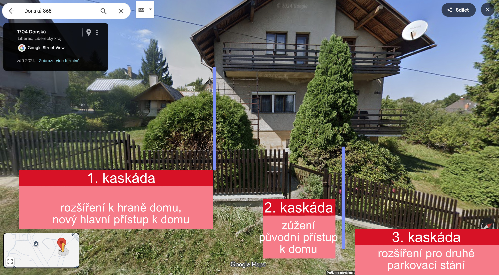

# Koncept rekonstrukce – cílový stav (1. fáze)

## Návrhy architekta

- [Architekt_Prosinec_2025.pdf](Architekt_Prosinec_2025.pdf) - **aktuální návrh**

---

## Základní rámec projektu
Rekonstrukce je plánována ve fázích.
V **první fázi** se zaměřujeme na:
- interiér domu
- vnější podobu domu
- technické rozvody

Zahrada a komplexní řešení exteriéru **nejsou předmětem 1. fáze**.
Budou řešeny samostatně v budoucnu.

---

## Ekonomický a časový přístup
- Rekonstrukce bude financována převážně z vlastních prostředků (cca 2–3 mil. Kč)
- Hypotéka na byt v Praze zůstává zachována
- Cílem je ekonomicky rozumný postup bez nutnosti dalšího zadlužení
- Časový tlak není zásadní:
  - 2025–2026: bourací a stavební práce
  - 2027–2028: postupné zabydlování

Neřeší se:
- zbytečné zásahy bez přidané hodnoty
- výměna funkčních prvků (např. střecha), pokud to nebude nutné

---

## Hlavní principy návrhu
- Více světla
- Otevřenější dispozice
- Moderní, ale střídmý výraz
- Nepřeplácané řešení
- Funkčnost a dlouhodobá udržitelnost

---

## Přístup k domu a prostor před garáží

### Stávající stav
Přístup k domu je v současnosti řešen pomocí tří kaskád před objektem:

- **Horní kaskáda** – úzký přístup k původnímu hlavnímu vstupu
- **Střední kaskáda** – navazuje na původní vstupní trasu
- **Spodní kaskáda** – prostor před garáží, aktuálně umožňuje parkování jednoho vozidla

Přehled kaskád a přístupu je zdokumentován na obrázku:

### Plánované změny
Stávající tři kaskády budou upraveny:

1. **Horní kaskáda**
   - Rozšíření až k hraně domu
   - Vznik nového hlavního vstupu do domu

2. **Střední kaskáda**
   - Zúžení
   - Zachování původního vstupu

3. **Spodní kaskáda**
   - Rozšíření do svahu
   - Vznik druhého parkovacího místa před garáží

---

## 1. podzemní podlaží
- Garáž bez dispozičních změn
- Výměna vrat za automatická
- Centrální místnost:
  - odstranění vany
  - vznik prádelny (pračka + sušička)
  - doplnění vytápění
- Zachování bojleru (po ověření funkčnosti)
- Zachování tepelného vrtu jako hlavního zdroje tepla
- Bývalý sklad uhlí:
  - příprava na saunu + sprchu
  - příprava rozvodů (voda, odpady, elektro)

---

## 1. nadzemní podlaží – hlavní obytný prostor
- Zrušení původního hlavního vstupu
- Nový hlavní vstup orientovaný do zahrady
- Kuchyně → zádveří / chodba s úložnými prostory
- Nová koupelna s WC a sprchou
- Otevření obytného prostoru do tvaru „L“
- Kuchyně ve vyvýšené části (U + jídelní stůl)
- Obývací část:
  - knihovna / bar u schodiště
  - krbová vložka
- Nutné sondy:
  - vyvýšená podlaha
  - nosné zdi
  - krb a komín

---

## 2. nadzemní podlaží
- Modernizace koupelny (otevřený sprchový kout, možnost dvojitého umyvadla)
- Ložnice:
  - úvaha o průchozí šatně (nutno ověřit statikem)
- Dětský pokoj + pracovna bez zásadních dispozičních změn
- Odstranění balkonu orientovaného do ulice

---

## Půda
- Bez stavebních zásahů
- Pouze zjednodušení přístupu