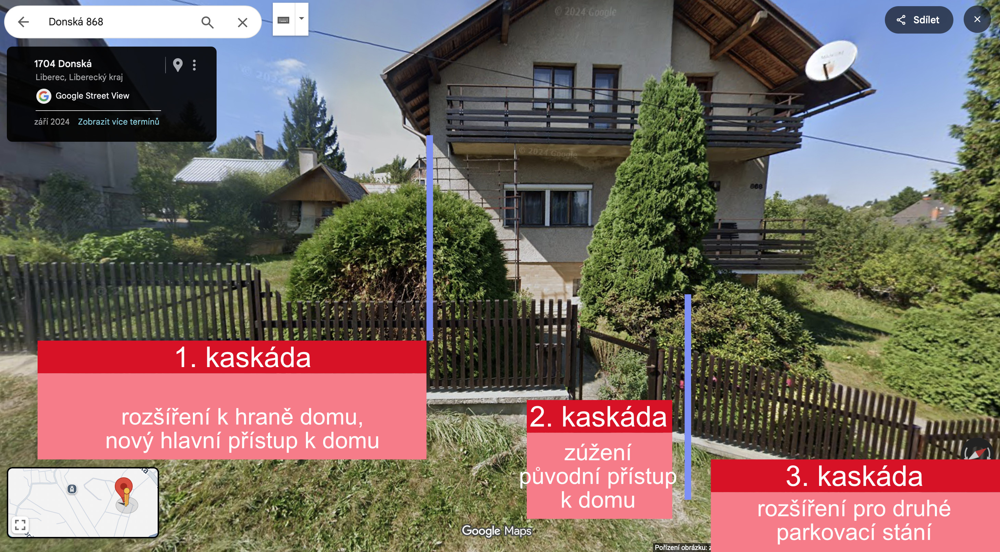

# Koncept rekonstrukce – cílový stav

## Návrhy architekta

| Verze | Datum | Soubor |
|---|---|---|
| **Aktuální** | 12. 6. 2026 | [Interier_12.6.2026.pdf](Interier_12.6.2026.pdf) |
| Předchozí | Prosinec 2025 | [Architekt_Prosinec_2025.pdf](Architekt_Prosinec_2025.pdf) |

Architekt: Ing. Pražáková

---

## Aktuální design (12. 6. 2026)

Nejnovější verze od architekta potvrzuje klíčová rozhodnutí a přináší konkrétní vizualizace:

**Living room / obývací pokoj**
- Krb v rohu místnosti před komínem (komín zůstává na místě)
- Pod krbem prostor na dřevo
- Tmavá dřevěná podlaha se zachovaným betonovým stupínkem

**Kitchen / kuchyně**
- Bar pult s barovými stoličkami propojující kuchyni s jídelnou
- Kuchyňský ostrov s tmavou pracovní deskou
- Kombinace dřevěných + světlých/krémových frontiček
- Side-by-side lednice + zabudovaná trouba
- Herringbone parket v kuchyňské části

**Dining / jídelna**
- Herringbone parket
- Jídelní stůl propojený s barem

**Bathroom / koupelna (1.NP)**
- Modro-tyrkysová dlažba

---

## Základní rámec projektu

Rekonstrukce je plánována ve fázích. **První fáze** zahrnuje interiér domu, vnější podobu a technické rozvody. Zahrada a exteriér jsou předmětem samostatné budoucí fáze.

**Ekonomický přístup**
- Rekonstrukce financována z vlastních prostředků (cca 2–3 mil. Kč)
- Cílem ekonomicky rozumný postup bez dalšího zadlužení
- Orientační harmonogram: 2025–2026 bourací a stavební práce, 2027–2028 zabydlování

---

## Hlavní principy návrhu
- Více světla, otevřenější dispozice
- Moderní, ale střídmý výraz
- Funkčnost a dlouhodobá udržitelnost

---

## Přístup k domu a prostor před garáží

Tři stávající kaskády před objektem budou upraveny:

1. **Horní kaskáda** – rozšíření k hraně domu, nový hlavní vstup
2. **Střední kaskáda** – zúžení, zachování původního vstupu
3. **Spodní kaskáda** – rozšíření do svahu, druhé parkovací místo

---

## 1. podzemní podlaží
- Garáž bez dispozičních změn, výměna vrat za automatická
- Centrální místnost: odstranění vany, vznik prádelny, doplnění vytápění
- Zachování tepelného čerpadla jako hlavního zdroje tepla
- Bývalý sklad uhlí: příprava na saunu + sprchu

---

## 1. nadzemní podlaží – hlavní obytný prostor
- Zrušení původního hlavního vstupu
- Nový hlavní vstup orientovaný do zahrady
- Otevření obytného prostoru do tvaru „L"
- Bar pult propojující kuchyni a jídelnu (s barovými stoličkami)
- Kuchyňský ostrov
- Krb v rohu před komínem
- Herringbone parket v celém main living area
- Koupelna s WC a sprchou (tyrkysová dlažba)

---

## 2. nadzemní podlaží (podkroví)
- Modernizace koupelny
- Ložnice, dětský pokoj, pracovna bez zásadních dispozičních změn
- Odstranění balkonu do ulice

---

## Půda
- Bez stavebních zásahů, pouze zjednodušení přístupu
