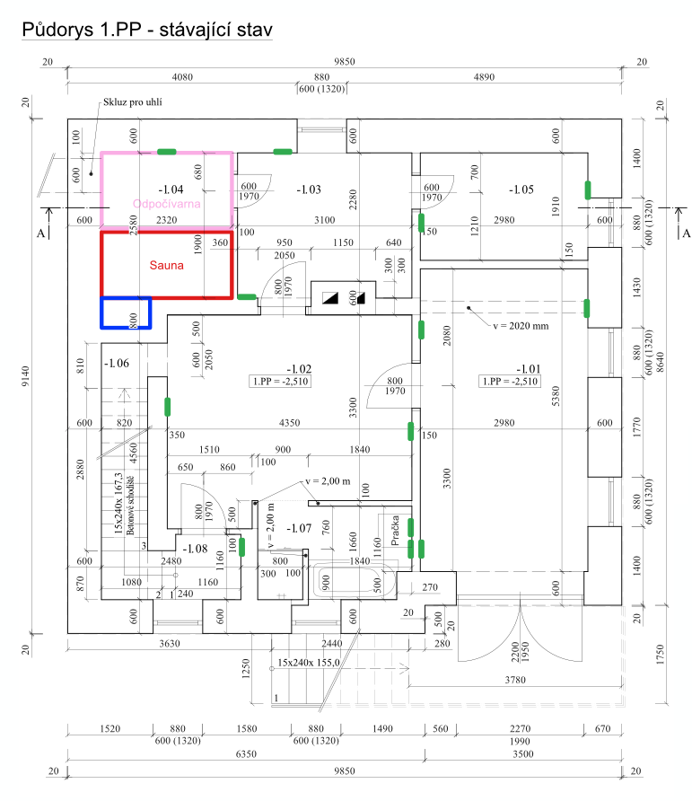
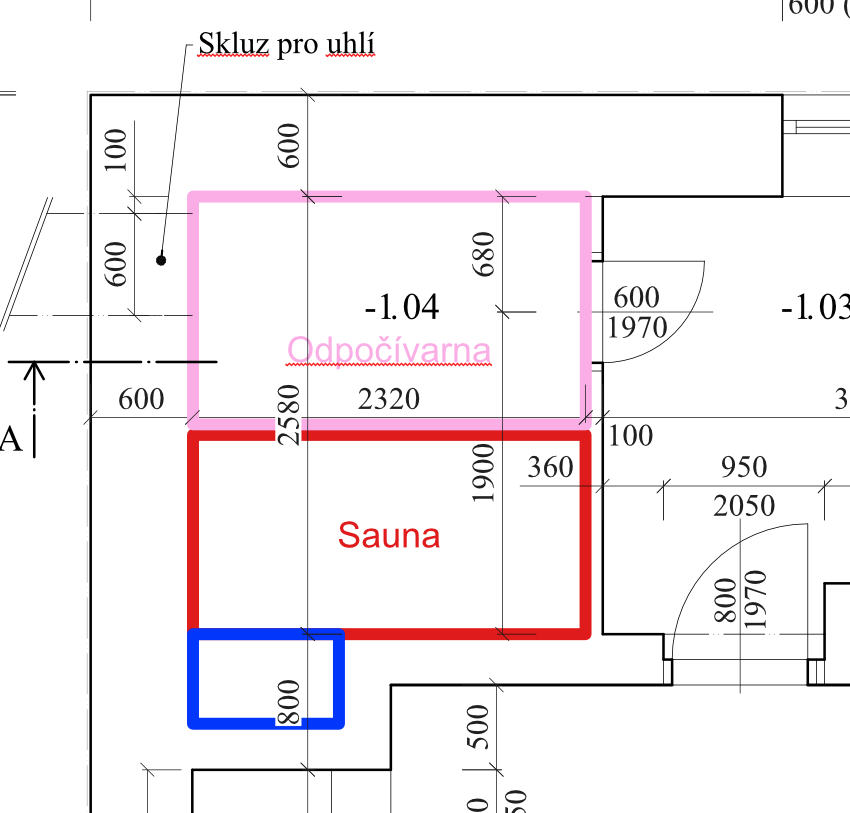

# Přehled plánovaných úprav — místnost po místnosti

Dokument popisuje plánované stavební a dispoziční úpravy pro potřeby projektové dokumentace.
Nezahrnuje: výměnu oken a dveří (řeší se samostatně), vytápění, běžnou revitalizaci (malby).

Podlahy: stávající parkety zachováváme a revitalizujeme ve všech místnostech, kde jsou přítomny.

---

1. podzemní podlaží

### Oblast před garáží *(mimo dům)*

- Příprava druhého parkovacího stání — terénní úprava, násyp
- Výměna plotových vrat u vjezdu za elektrická

### 1.01 Garáž

#### Stavební

- Výměna stávajících vrat za elektrická sekční vrata

#### Elektro

- Zachovat stávající zásuvky
- Přidat 1 zásuvku na stěně u vstupních vrat

### 1.02 Chodba

#### Stavební

- Bojler pravděpodobně zůstává na pravé straně při východu z garáže
- Podlaha: doporučujeme LVT vinyl nebo adekvátní alternativu — vodotěsná, příjemná na dotek; konkrétní materiál může být navržen projektantem

#### Elektro

- Zásuvka na levé straně při východu z garáže
- Zásuvka na protější stěně

#### Ostatní

- Jiné úložné prostory nenavrhovat, bude využit stávající nábytek

### 1.03 Kotelna

#### Stavební

- Odstranění kotle na tuhá paliva; zůstává pouze tepelné čerpadlo
- Revitalizace prostoru
- Podlaha: doporučujeme LVT vinyl nebo adekvátní alternativu — stejný materiál jako v chodbě, prostor je pravidelně využíván včetně průchodu ze sauny do sprchy

#### Elektro

- Zásuvka nalevo od vstupních dveří
- Zásuvka na protější stěně

### 1.04 Uhelna → Sauna + Odpočívárna

#### Stavební

- Skluz pro uhlí zabetonovat
- Vyklenek pod schody zabetonovat — zajistí obdélníkový tvar sauny; vyklenek není zaznamenán v pasportu stavby, je vyznačen modře v přiloženém nákresu
- Sauna umístěná na stěně přiléhající ke schodišti
- Před saunou prostor odpočívárny s relaxačním obkladem; odděleno dveřmi směrem ke kotelně
- Sprcha pro saunu se v této místnosti nevytváří — bude využívána v -1.07 Umývárna

#### Elektro

- Zásuvka v prostoru odpočívárny

### 1.05 Sklep

#### Stavební

- Bez zásadních úprav
- Stávající okno: průsvitná nebo tmavá úprava (redukce světla)

#### Elektro

- Zásuvka napravo od vstupních dveří
- Zásuvka na protější stěně u okna

#### Otevřené otázky

- Umístění lednice — zatím nerozhodnuto

### 1.06 Komora *(prostor pod schody)*

#### Stavební

- Úložný prostor, bude využit stávající nábytek
- Nutné osvětlení

#### Elektro

- Pouze osvětlení, bez zásuvek

### 1.07 Umývárna

#### Stavební

- Odstranění vany; instalace výlevky / technického umyvadla (hluboký dřez pro předpírání prádla)
- Revitalizace stávajícího sprchového koutu, uzavřené provedení
- Pračka a sušička na sobě, umístění na stěně
- Úzká úložná skříň vedle pračky/sušičky
- Úzká úložná skříň vedle výlevky

#### Elektro

- Zásuvky pro pračku a sušičku na stěně za spotřebiči

### 1.08 Chodba + schodiště

- Revitalizace, žádné zásadní stavební změny

---

1. nadzemní podlaží

### Zádveří (rozšíření do původní chodby)

- Zádveří se rozšíří do prostoru původní chodby
- Odkládací stěna: věšák na kabáty, botník, prostor na tašky a doplňky
- Lavice nebo prostor pro sezení při obouvání

### Koupelna (rozšíření do původní chodby)

- Koupelna se rozšíří do části původní chodby
- Přístup přes posuvné dveře (úspora místa)
- Sprchový kout — preferujeme průchozí variantu
- WC, umyvadlo

### Obývací pokoj

- Nový vstup přímo z rozšířeného zádveří (původní chodba)
- Přesunutí krbu do rohové pozice před komínem
- TV stěna na místě původního krbu
- Stávající dřevěné obložení zadní stěny zůstává, bude revitalizováno
- Knihovna nebo police v rohu místnosti

### Jídelna

- Zaslepení průchodu do původní chodby, protažení stěny k obvodové zdi
- Jídelní stůl situovaný u této stěny
- Na stěně u schodiště knihovna nebo skříně — nesmí blokovat průhled na schody

### Kuchyně

- Probourání stěny do jídelny a vytvoření barového pultu s barovými stoličkami
- Vybourání zadní stěny původního krbového tělesa (dle statického posouzení)
- Rozšíření venkovních dveří (výstup do zahrady / na terasu)
- Kuchyňský ostrov
- Odkládací prostor pro úklidové potřeby (případně lze umístit v 1.PP)

---

Podkroví

### Chodba

- Předělání a rozšíření výlezu na půdu
- Ideálně skládací schody

### Koupelna

- Výměna vany za větší model
- Průchozí sprchový kout
- Odstranění bidetu
- Dvě umyvadla
- Velké zrcadlo + toaletní skříňka

### Ložnice (1. místnost vpravo)

- Postel u stěny přiléhající ke schodišti
- Šatní skříň přes celou protější stěnu
- Přilehlá komora: bez konkrétního záměru, nejspíš úložiště zavazadel a kufrů — přivítáme nápad na lepší využití

### Dětský pokoj (2. místnost vlevo)

- Navrhnout rozvržení pro: postel, pracovní stůl, šatní skříň, komodu a hrací prostor
- Pokud prostor dovolí: menší gauč / sedací kout a TV na stěnu

### Pracovna / pokoj pro hosty

- Rozkládací gauč (funkce pro hosty)
- Pracovní stůl
- Vestavěná skříň ve stávajícím vykrojení prostoru

### Balkon

- Revitalizace
- Případný návrh jednoduchého sezení — využití předpokládáme minimální
